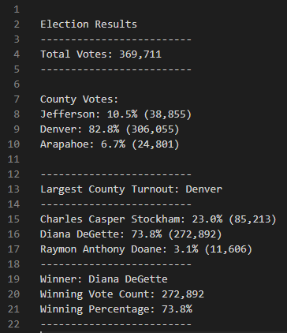

# Election Analysis
This report outlines the steps taken to analyze and summarize lelction results data within an election precinct of three counties.

## Project Overview

### Overview
The project focus is on a tri-county area elections results. The results will be extracted form a flat file provided by the county election commission.  The data will be then analyzed to determine a set of deliverables including the winner of the election.

### Deliverables
The data file will be analyzed for the following.
1. The total number of votes cast.
2. A complete list of candidates who received votes.
3. The total number of votes each candidate received.
4. Percentage of votes each candidate won
5. The winner of the election based on popular vote.
6. The turnout of voter by county.
7. Percentage of voters from each county based on the total turnout.
8. The county with the highest voter turnout.
The analyzed data then will be displayed to computer screen and stored into a text file for future reference.

## Resources
A data source, software and a repository were using as resources during this project.
- Data Source: The election results were provided through a data file election_results.csv, a comma separated value file.
- Sofware
    1. Python 3.7: Python 3.7 was utilized as the analysis package where the election result data was manpulated.
    2. Visual Studios Code 1.61.1: The text editor where the code for the analysis algorithms was written.
- Repository: GitHub was used as the repository to store, update and share the code with the project group.

## Election Results
The election was held over three counties where three candidates competed for the position.  A summary data is provided below.
    - There were a total of 369,711 votes cast in this election.
    - There were three counties, Jefferson, Denver and Arapahoe included in this election.  The county vote distribution within the precinct is displayed below.
        - Jefferson county cast 38,855 votes, a 10.5% of the total votes.
        - Denver county cast 306,055 votes, a 82.8& of the total votes.
        - Arapahoe county cast 24,801 votes, a 6.7% of the total votes.
    - The results also show that Denver county had the largest voter turnout with 306,055 votes cast.
    - There were three candidtes on the ballot.  The vote distribution is as follows.
        - Candidate Charles Casper Stockham received 23.0% of the votes accumulating 85,213 votes.
        - Candidate Diana DeGette received 73.8% of the votes accumulating 272,892 votes.
        - Raymon Anthony Doane received 3.1% of the votes accumulating 11,606 votes.
    - In this election the clear winner is Diana DeGette who received 73.8% of the total vote accumulating 272,892 votes.
    

## Election Summary
Data within a flat file with three columns that included a Ballot ID, County Name and Candidate Name was extracted, transformed, and then a set of summary results saved to determine a winner of a county level election.  All of this was accomplished simply using a set of Python script that included lists, dictionaries, loops and conditional statements. This script can be easily expanded to do more either with the existing dataset or an expanded dataset.

### Existing Dataset (Example 1)
The current dataset has three columns that includes ballot ids, county names and candidate names included in its columns. There is another level of data that can easily be accesses with this data set.  And that is the county level distribution of votes for each candidate. This can be accomplished by including a nested (For) loop that tracks the votes per candidate per county. The summaries then can be calculated to display the vote summary for a candidate within a county.

### Expanded Dataset (Example 2)
Another way that we can improve on the scripting is to modify the it to accomodate additional columns to track multiple positions or issues. For instance, the current dataset tracks a precinct level candidate in the column labeled Candidate. Consider an additional column to include a county level candidate.  The summaries then can be calculated by editing the scripts to include variables to track the county level candidates such as a county commissioner.

## Conclusions
Python scripting is a powerful tool that can accomplish many tasks in summarizing data. As illustrated in the above two examples the functionality can be altered to match the need at hand. With the given two examples as the basis, it can be deduced that scripting can be adjusted to include a much larger dataset with multiple columns.

I would be happy to assist in the expansion of the scripting if the precinct does move in that direction.
